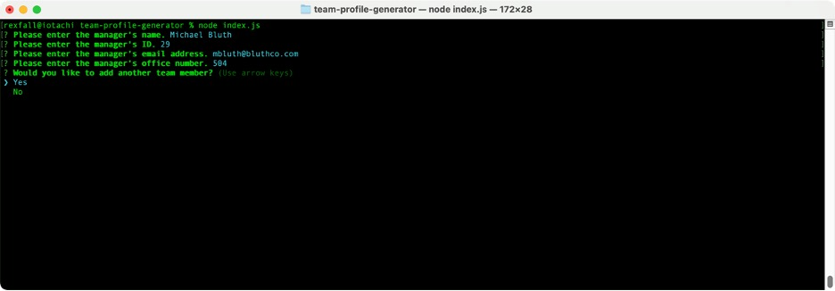
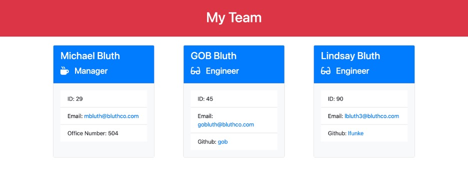

# Team Profile Generator 

## Technology Used 

| Technology Used         | Resource URL           | 
| ------------- |:-------------:| 
| HTML    | [https://developer.mozilla.org/en-US/docs/Web/HTML](https://developer.mozilla.org/en-US/docs/Web/HTML) | 
| JavaScript | [https://developer.mozilla.org/en-US/docs/Web/JavaScript](https://developer.mozilla.org/en-US/docs/Web/JavaScript) |
| Node.js | [https://nodejs.org/en/](https://nodejs.org/en/) |
| Inquirer | [https://www.npmjs.com/package/inquirer/v/8.2.4](https://www.npmjs.com/package/inquirer/v/8.2.4) |
| Jest | [https://jestjs.io/](https://jestjs.io/) |

<br/>

## Description 


This command line application prompts the user to enter pertinent details about a team manager and offers the option to add as many additional team members as desired. The prompts are tailored to the team member's role, and the user's answers are validated and sanitized.

When the user elects to stop adding team members, the application dynamically generates an HTML file to display the details for each team member, including active links for each team member's email address and (if applicable) GitHub profile.

In addition, this project incorporates unit testing using Jest. Each class in this application was created with a Test Driven Development (TDD) methodology, in which the tests were written first and the application code was written to satisfy the tests.

<br/>

## Installation and Usage 

### Installation

1. Open the Code menu and select Download ZIP. 
2. Move the ZIP file to the desired location on your hard drive and unzip it. 
3. Using a command line interface, navigate into the team-profile-generator-main directory.
4. run the command ```npm install``` to install the necessary dependencies.

<br/>

### Usage

[Watch the Walk-through Video](https://watch.screencastify.com/v/ZpsMvBIsEpqGR4S3sYnY)
1. Launch the application from your terminal with the command ```node index.js```.
2. Follow the prompts to provide details for each team member you wish to add (see below).

<br/>



<br/>

3. The application automatically generates an HTML file and saves it in the dist directory. The image below shows an example of an HTML file generated by this application, viewed in a web browser.

<br/>



<br/>

## Learning Points 

By completing this project, I learned how to complete JavaScript unit testing with Jest. My experience with Jest was very different from my previous experience using JUnit for Java unit testing.

<br/>

## Author Info

### Ryan Moscoe 

* [Portfolio](https://rmoscoe.github.io/portfolio/)
* [LinkedIn](https://www.linkedin.com/in/ryan-moscoe-8652973/)
* [Github](https://github.com/rmoscoe)

<br/>

## License

See repo for license information.